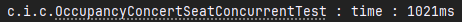
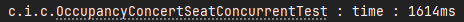
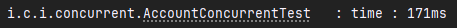
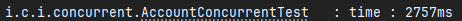
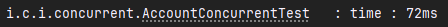
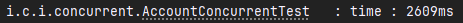
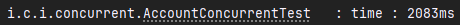

## 시나리오 선정
콘서트 예약 서비스

### 시나리오 요구사항
- 유저 토큰 발급 API
- 예약 가능 날짜 / 좌석 API
- 좌석 예약 요청 API
- 잔액 충전 / 조회 API
- 결제 API

유저 대기열 토큰 기능
- 서비스를 이용할 토큰을 발급받는 API를 작성합니다.
- 토큰은 유저의 UUID 와 해당 유저의 대기열을 관리할 수 있는 정보
  ( 대기 순서 or 잔여 시간 등 ) 를 포함합니다.
- 이후 대기열에 의해 **보호받는** 모든 API 는 위 토큰을 이용해 대기열 검증을 통과해야 이용 가능합니다.
- **내 대기번호를 조회하는 폴링용 API를 작성합니다.**

예약 가능 날짜 / 좌석 API
- 예약가능한 날짜와 해당 날짜의 좌석을 조회하는 API 를 각각 작성합니다.
- 예약 가능한 날짜 목록을 조회할 수 있습니다.
- 날짜 정보를 입력받아 예약가능한 좌석정보를 조회할 수 있습니다.
- 좌석 정보는 1 ~ 50 까지의 좌석번호로 관리됩니다.

좌석 예약 요청 API
- 좌석 예약과 동시에 해당 좌석은 그 유저에게 약 5분간 임시 배정됩니다. ( 시간은 정책에 따라 자율적으로 정의합니다. )
- 날짜와 좌석 정보를 입력받아 좌석을 예약 처리하는 API 를 작성합니다.
- 만약 배정 시간 내에 결제가 완료되지 않는다면 좌석에 대한 임시 배정은 해제되어야 하며
  임시배정 상태의 좌석에 대해 다른 사용자는 예약할 수 없어야 한다.

잔액 충전 / 조회 API
- 결제에 사용될 금액을 API 를 통해 충전하는 API 를 작성합니다.
- 사용자 식별자 및 충전할 금액을 받아 잔액을 충전합니다.
- 사용자 식별자를 통해 해당 사용자의 잔액을 조회합니다.

결제 API
- 결제 처리하고 결제 내역을 생성하는 API 를 작성합니다.
- 결제가 완료되면 해당 좌석의 소유권을 유저에게
  배정하고 대기열 토큰을 만료시킵니다.

### 요구사항 분석 및 기능 도출

토큰을 발급 하는 기능
- 토큰을 만든다.
- 한 유저가 여러번의 토큰을 만들 수 있다.(여러번의 대기열 참가 가능하기 위해)

대기열에 해당 토큰을 진입시키는 기능
- 해당 토큰을 대기열에 넣는다.
- 한 유저가 여러개의 토큰으로 여러 대기열에 참가할 수 있다.

대기열 해당 토큰을 만료시키는 기능
- 대기열의 토큰 상태를 바꾼다.

내 대기번호를 조회하는 기능
- 폴링용으로 현재 나의 대기번호가 몇번인지 조회한다.
- 토큰으로 확인해야 한다.

토큰의 대기열 검증 기능
- 이 토큰이 해당 대기열에서 유효한지 확인한다.

토큰의 유효성을 검증하는 기능
- 이 토큰 검증(해당 콘서트가 맞는지 등) 한다.

해당 콘서트의 예약 가능한 날짜를 조회하는 기능
- 해당 콘서트가 존재하는지 검사해야 한다.
- 한 콘서트는 여러개의 예약 가능한 날짜를 가질 수 있다.

해당 콘서트의 해당 날짜의 좌석 정보를 조회하는 기능
- 해당 콘서트가 존재하는지 검사해야 한다.
- 해당 콘서트, 해당 날짜의 좌석 정보(잔여 좌석)를 조회 한다.

좌석을 예약하여 임시로 점유하는 기능
- 해당 콘서트가 존재하는지 검사해야 한다.
- 정책에 따른 시간동안 좌석을 점유해야 한다.(이 시간동안 다른 유저는 접근금지)
- 임시 점유 시간동안 결제가 완료되지 않으면 점유를 해제해야한다.

잔액을 충전하는 기능
- 해당 유저가 존재하는지 검사해야 한다.
- 동시에 충전한다고 했을때 정상적으로 충전 후 잔액이 보여야 한다.

잔액을 조회하는 기능
- 해당 유저가 존재하는지 검사해야 한다.
- 현재 잔액을 보여준다.

결제 하는 기능
- 해당 유저가 존재하는지 검사해야 한다.
- 잔액이 부족하면 결제가 불가하다.
- 동시에 결제한다고 했을때 정상적으로 결제가 진행되어야 한다.

### 플로우 차트


### API 명세서
## ERD


## 기술 스택
- Java 23
- Spring Boot 3.3.4
- RDB : MySQL
- ORM : JPA
- TEST : Junit + AssertJ
### Architecture
```
interfaces/
    account/
        AccountController.java
        AccountDto.java
    concert/
        ConcertController.java
        ConcertDto.java
    queue/
        QueueController.java
        QueueDto.java
    ResponseDto.java
    ResponseCode.java
application/
    facade
domain/
    entity
    service
    repository
infrastructure/
    repositoryImpl

```

## API 명세서

## 콘서트

## 1. **콘서트 정보 조회**
### **GET** `/concerts/{concertId}/info`

**설명:** 특정 콘서트의 정보를 조회합니다.

### **Request:**
- Path Parameters:
  - `concertId` (Long): 조회할 콘서트의 ID.

### **Response:**
- ResponseDto: 콘서트 정보 리스트.
  - `code` (String): 응답 코드 (예: "SUCC").
  - `data` (List of `ConcertInfoResponse`):
    - `concertId` (Long): 콘서트 ID.
    - `concertInfoId` (Long): 콘서트 정보 ID.
    - `concertName` (String): 콘서트 이름.
    - `concertDate` (String): 콘서트 날짜.

### **예시 응답:**
```json
{
  "code": "SUCC",
  "data": [
    {
      "concertId": 1,
      "concertInfoId": 1,
      "concertName": "2024 IU CONCERT HER",
      "concertDate": "2024-03-02"
    },
    {
      "concertId": 1,
      "concertInfoId": 2,
      "concertName": "2024 IU CONCERT HER",
      "concertDate": "2024-03-03"
    }
  ]
}
```

---

## 2. **콘서트 좌석 정보 조회**
### **GET** `/concerts/{concertId}/info/{concertInfoId}/seats`

**설명:** 특정 콘서트 정보에 대한 좌석 정보를 조회합니다.

### **Request:**
- Path Parameters:
  - `concertId` (Long): 콘서트 ID.
  - `concertInfoId` (Long): 콘서트 정보 ID.

### **Response:**
- ResponseDto: 콘서트 좌석 정보 리스트.
  - `code` (String): 응답 코드 (예: "SUCC").
  - `data` (List of `ConcertSeatResponse`):
    - `concertInfoId` (Long): 콘서트 정보 ID.
    - `concertSeatId` (Long): 좌석 ID.
    - `concertSeatNumber` (Integer): 좌석 번호.
    - `concertSeatStatus` (String): 좌석 상태 (예: "OPEN", "PAYMENT_WAIT", "CLOSE").

### **예시 응답:**
```json
{
  "code": "SUCC",
  "data": [
    {
      "concertInfoId": 1,
      "concertSeatId": 1,
      "concertSeatNumber": 1,
      "concertSeatStatus": "OPEN"
    },
    {
      "concertInfoId": 1,
      "concertSeatId": 2,
      "concertSeatNumber": 2,
      "concertSeatStatus": "OPEN"
    }
  ]
}
```

---

## 3. **좌석 예약**
### **POST** `/concerts/seats`

**설명:** 콘서트 좌석을 예약합니다. 결제가 되기 전까지 설정된 시간(ex. 5분)동안 좌석을 점유합니다.

### **Request:**
- Request Body:
  - `token` (String): 사용자 인증 토큰.
  - `concertInfoId` (Long): 예약할 콘서트 정보 ID.
  - `concertSeatId` (Long): 예약할 좌석 ID.

### **Request 예시:**
```json
{
  "token": "tempToken",
  "concertInfoId": 1,
  "concertSeatId": 5
}
```

### **Response:**
- ResponseDto: 예약된 좌석 정보.
  - `code` (String): 응답 코드 (예: "SUCC").
  - `data` (BookingSeatResponse):
    - `concertSeatId` (Long): 예약된 좌석 ID.
    - `expireMinute` (Integer): 임시 점유 시간 (분).

### **예시 응답:**
```json
{
  "code": "SUCC",
  "data": {
    "concertSeatId": 1,
    "expireMinute": 5
  }
}
```

---

## 4. **예약 정보 조회**
### **GET** `/concerts/booking/{memberId}/info/{bookingId}`

**설명:** 특정 회원의 예약 정보를 조회합니다.

### **Request:**
- Path Parameters:
  - `memberId` (Long): 회원 ID.
  - `bookingId` (Long): 예약 ID.

### **Response:**
- ResponseDto: 예약 정보.
  - `code` (String): 응답 코드 (예: "SUCC").
  - `data` (BookingInfoResponse):
    - `bookingId` (Long): 예약 ID.
    - `concertName` (String): 콘서트 이름.
    - `concertDate` (String): 콘서트 날짜.
    - `concertSeatNumber` (Integer): 예약된 좌석 번호.
    - `paymentAmount` (Long): 결제 금액.

### **예시 응답:**
```json
{
  "code": "SUCC",
  "data": {
    "bookingId": 1,
    "concertName": "2024 IU CONCERT HER",
    "concertDate": "2024-03-03",
    "concertSeatNumber": 1,
    "paymentAmount": 169000
  }
}
```

---

## 5. **회원 예약 리스트 조회**
### **GET** `/concerts/booking/{memberId}/info`

**설명:** 특정 회원의 모든 예약 정보를 조회합니다.

### **Request:**
- Path Parameters:
  - `memberId` (Long): 회원 ID.

### **Response:**
- ResponseDto: 예약 정보 리스트.
  - `code` (String): 응답 코드 (예: "SUCC").
  - `data` (List of `BookingInfoListResponse`):
    - `bookingId` (Long): 예약 ID.
    - `concertName` (String): 콘서트 이름.
    - `concertDate` (String): 콘서트 날짜.
    - `concertSeatNumber` (Integer): 예약된 좌석 번호.
    - `paymentAmount` (Long): 결제 금액.

### **예시 응답:**
```json
{
  "code": "SUCC",
  "data": [
    {
      "bookingId": 2,
      "concertName": "2024 IU CONCERT HER",
      "concertDate": "2024-03-02",
      "concertSeatNumber": 1,
      "paymentAmount": 169000
    },
    {
      "bookingId": 1,
      "concertName": "2024 IU CONCERT HER",
      "concertDate": "2024-03-03",
      "concertSeatNumber": 1,
      "paymentAmount": 169000
    }
  ]
}
```

## 계좌

## 1. **계좌 충전**
### **PATCH** `/accounts/charge`

**설명:** 회원의 계좌에 금액을 충전합니다.

### **Request:**
- Request Body:
  - `memberId` (Long): 회원 ID.
  - `amount` (Long): 충전할 금액.

### **Request 예시:**
```json
{
  "memberId": 1,
  "amount": 30000
}
```

### **Response:**
- ResponseDto: 충전 후 잔액 정보.
  - `code` (String): 응답 코드 (예: "SUCC").
  - `data` (ChargeResponse):
    - `balance` (Long): 충전 후 잔액.

### **예시 응답:**
```json
{
  "code": "SUCC",
  "data": {
    "balance": 30000
  }
}
```

---

## 2. **결제 처리**
### **PATCH** `/accounts/payment`

**설명:** 회원의 계좌에서 콘서트 예약에 대한 결제를 처리합니다. 좌석 완전 점유, 대기열 토큰 만료가 포함되어 있습니다. 결제 후 티케팅이 완료 됩니다.

### **Request:**
- Request Body:
  - `token` (String): 사용자 인증 토큰.
  - `concertInfoId` (Long): 예약할 콘서트 정보 ID.
  - `concertSeatId` (Long): 예약할 좌석 ID.
  - `amount` (Long): 결제할 금액.

### **Request 예시:**
```json
{
  "token": "user-auth-token",
  "concertInfoId": 1,
  "concertSeatId": 5,
  "amount": 169000
}
```

### **Response:**
- ResponseDto: 결제 정보.
  - `code` (String): 응답 코드 (예: "SUCC").
  - `data` (PaymentResponse):
    - `concertName` (String): 콘서트 이름.
    - `concertDate` (String): 콘서트 날짜.
    - `concertSeatNumber` (Integer): 좌석 번호.
    - `paymentAmount` (Long): 결제된 금액.

### **예시 응답:**
```json
{
  "code": "SUCC",
  "data": {
    "concertName": "2024 IU CONCERT HER",
    "concertDate": "2024-03-03",
    "concertSeatNumber": 1,
    "paymentAmount": 169000
  }
}
```

---

## 3. **계좌 잔액 조회**
### **GET** `/accounts/{memberId}/balance`

**설명:** 회원의 계좌 잔액을 조회합니다.

### **Request:**
- Path Parameters:
  - `memberId` (Long): 조회할 회원의 ID.

### **Response:**
- ResponseDto: 회원의 계좌 잔액 정보.
  - `code` (String): 응답 코드 (예: "SUCC").
  - `data` (AccountBalanceResponse):
    - `balance` (Long): 계좌 잔액.

### **예시 응답:**
```json
{
  "code": "SUCC",
  "data": {
    "balance": 30000
  }
}
```

## 대기열

## 1. **토큰 발급**
### **POST** `/queues/token`

**설명:** 사용자에게 대기열에 대한 토큰을 발급합니다. 대기열에 진입시키고 토큰을 반환합니다.

### **Request:**
- Request Body:
  - `userId` (Long): 사용자 ID.
  - `concertInfoId` (Long): 콘서트 정보 ID.

### **Request 예시:**
```json
{
  "userId": 1,
  "concertInfoId": 1
}
```

### **Response:**
- ResponseDto: 발급된 토큰 정보.
  - `code` (String): 응답 코드 (예: "SUCC").
  - `data` (IssueTokenResponse):
    - `token` (String): 발급된 토큰.

### **예시 응답:**
```json
{
  "code": "SUCC",
  "data": {
    "token": "tempToken"
  }
}
```

---

## 2. **대기 번호 조회**
### **GET** `/queues/waiting_number`

**설명:** 현재 사용자의 대기 번호를 조회합니다.

### **Request:**
- Path Parameters: 없음.

### **Response:**
- ResponseDto: 대기 번호 정보.
  - `code` (String): 응답 코드 (예: "SUCC").
  - `data` (WaitingNumberResponse):
    - `waitingNumber` (Integer): 현재 대기 번호.

### **예시 응답:**
```json
{
  "code": "SUCC",
  "data": {
    "waitingNumber": 5042
  }
}
```


### Swagger


# 동시성 이슈에 대한 분석
## 동시성 이슈가 나타날 기능
- 콘서트 좌석 임시 점유
- 포인트 충전 및 결제

## DB락의 종류
### 비관적 락 (Pessimistic Lock)

DB에서 트랜잭션 내에서 해당 로우에 락을 거는 방식<br>
update 시에는 자동적으로 쓰기 락이 걸린다.(READ COMMITTED 이상의 격리 수준에서)<br>
비관적 락을 구현할때 JPA에서는 해당 쿼리 메소드에 @Lock을 사용
```java
    @Lock(LockModeType.PESSIMISTIC_WRITE) or @Lock(LockModeType.PESSIMISTIC_READ)
    ConcertSeat getConcertSeatByConcertSeatId(Long concertSeatId);
```
예시 쿼리 :
```sql
/* PESSIMISTIC_WRITE */
SELECT *
  FROM CONCERT_SEAT
 WHERE CONCERT_SEAT_ID = 1
   FOR UPDATE

/* PESSIMISTIC_READ */
SELECT *
  FROM CONCERT_SEAT
 WHERE CONCERT_SEAT_ID = 1
  LOCK IN SHARE MODE;
```

이 때 해당 로우에 트랜잭션이 유지되는 동안 락이 걸리게 된다.

```sql
SELECT *
  FROM CONCERT_SEAT
 WHERE CONCERT_SEAT_ID = 1
```
MYSQL의 경우 for update로 해당 로우에 락을 걸어도 위의 쿼리로 조회를 하면 조회가 가능하다.(MVCC)

### 낙관적 락

낙관적 락은 version이라는 컬럼을 두어 버전 차이를 이용하여 로직상의 락을 구현하는 방식
entity에 version 컬럼 하나를 추가 하여 사용
```java
    @Version
    private int version;
```
JPA가 update 시에 set에 version + 1 한걸 자동으로 날린다.<br>
트랜잭션 범위 내에서 변경 감지 후 트랜잭션이 종료되기 전 update 문이 실행된다.
```sql
UPDATE CONCERT_SEAT
   SET concert_info_id = ?
     , created_at = ?
     , deleted_at = ?
     , member_id = ?
     , seat_number = ?
     , seat_status = ?
     , updated_at = ?
     , version = 1
 WHERE CONCERT_SEAT_ID = 1
   AND VERSION = 0
```
DB상에서는 락을 거는것이 아니기 때문에(최초 업데이트는 쓰기락이 걸리지만) 이후 공유자원에 대한 요청들은 업데이트 대상 로우가 없기 때문에 비관적 락에 비해 성능 저하가 일어나지 않는다.<br>
DB상에 오류가 나는건 아니지만 update에 대한 리턴이 없을 경우 Hibernate는 OptimisticLockException이 발생하고 Spring은 ObjectOptimisticLockingFailureException로 변환하여 해당 예외가 발생한다.

## 기능에 대한 테스트
### 콘서트 좌석 임시 점유
콘서트 좌석 임시 점유의 경우 최초의 좌석 점유가 되면 이후의 좌석 점유 요청들은 실패가 되기만 하면 됨
- 비관적 락 적용
- 조회부터 읽기 & 쓰기락이 걸림
```java
    @Lock(LockModeType.PESSIMISTIC_WRITE)
    ConcertSeat getConcertSeatByConcertSeatId(Long concertSeatId);
```
```java
    ConcertSeat getConcertSeat = concertSeatRepository.getConcertSeatByIdForUpdate(command.concertSeatId());
    if (getConcertSeat.getMemberId() != null && !getConcertSeat.getSeatStatus().equals(SeatStatus.OPEN)) {
        throw new ConcertBookingException(ErrorCode.OCCUPANCY_SEAT);
    }
    getConcertSeat.occupancySeat(command.memberId());
```
- 낙관적 락 적용
- 락이 걸리지 않는 조회
```java
    @Version
    private int version;
```
```java
    ConcertSeat getConcertSeat = concertSeatRepository.getConcertSeatById(command.concertSeatId());
    if (getConcertSeat.getMemberId() != null && !getConcertSeat.getSeatStatus().equals(SeatStatus.OPEN)) {
        throw new ConcertBookingException(ErrorCode.OCCUPANCY_SEAT);
    }
    getConcertSeat.occupancySeat(command.memberId());
```

쓰레드 1000건의 동시성 테스트
```java
    // given
    long concertSeatId = 1L;
    
    final List<Long> failList = new ArrayList<>();
    final List<Long> successList = new ArrayList<>();
    
    // when
    int threadCount = 1000;
    ExecutorService executorService = Executors.newFixedThreadPool(threadCount);
    CountDownLatch countDownLatch = new CountDownLatch(threadCount);
    for (int i = 1; i < threadCount + 1; i++) {
        final int index = i;
        ConcertSeatDomainDto.OccupancySeatCommand command = new ConcertSeatDomainDto.OccupancySeatCommand(concertSeatId, index);
        executorService.execute(() -> {
            try {
                concertSeatService.occupancySeat(command);
                successList.add((long) index);
            } catch (Exception e) {
                failList.add((long) index);
            } finally {
                countDownLatch.countDown();
            }
        });
    }
    countDownLatch.await();
    
    ConcertSeat concertSeatByMemberId = concertSeatJpaRepository.getConcertSeatByMemberId(successList.getFirst());
    
    // then
    assertAll(() -> {
        assertNotNull(concertSeatByMemberId);
        assertEquals(successList.size(), 1);
        assertEquals(successList.getFirst(), concertSeatByMemberId.getMemberId());
    });
```
- CountDownLatch와 ExecutorService를 사용하여 1000개의 쓰레드를 동시에 실행해 좌석 점유 동시성 테스트를 수행
- occupancySeat 메소드가 실행되며 성공/실패한 경우 각각 successList와 failList에 기록
- 테스트 종료 후 첫 번째 성공한 사용자 ID가 데이터베이스에 반영되었는지 확인
- 처리 시간은 startTime과 endTime을 통해 기록

낙관적 락을 적용 했을 때<br>


비관적 락을 적용 했을 때<br>


- 비관적 락 대비 낙관적 락 사용 시 약 36퍼의 성능 차이를 보임.
- 비관적 락의 경우 조회부터 DB 락이 걸리기에 성능 저하가 있다.
- 낙관적 락의 경우 조회는 락이 걸리지 않기 때문에 비관적 락 대비 성능 저하가 없음.
- 낙관적 락의 경우 재시도 로직을 작성해야 하지만 이후 요청들은 그냥 실패하면 되기때문에 재시도 로직을 작성할 필요가 없다.
- 따라서 좌석 임시 점유의 경우 낙관적 락이 더 좋아보인다.

### 포인트 충전 및 결제
- 비관적 락 적용
```java
    @Lock(LockModeType.PESSIMISTIC_WRITE)
    Account getAccountByAccountId(long accountId);
```
```java
    // 충전
    @Transactional
    public AccountDomainDto.ChargeAccountInfo chargeAccount(AccountDomainDto.ChargeAccountCommand command) {
        Account getAccount = accountRepository.getAccountByIdForUpdate(command.accountId());
        getAccount.chargeBalance(command.amount());

        AccountHistory accountHistory = new AccountHistory(getAccount.getAccountId(), AccountType.CHARGE, command.amount());
        accountHistoryRepository.save(accountHistory);

        return new AccountDomainDto.ChargeAccountInfo(getAccount.getAccountId(), accountHistory.getAmount(), getAccount.getBalance());
    }
    // 결제
    @Transactional
    public AccountDomainDto.PaymentAccountInfo paymentAccount(AccountDomainDto.PaymentAccountCommand command) {
        Account getAccount = accountRepository.getAccountByIdForUpdate(command.accountId());
        Long balance = getAccount.getBalance();
        Long amount = command.amount();
        if (balance - amount < 0) {
            throw new ConcertBookingException(ErrorCode.NOT_ENOUGH_BALANCE);
        }
        getAccount.paymentBalance(command.amount());
    
        AccountHistory accountHistory = new AccountHistory(getAccount.getAccountId(), AccountType.PAYMENT, command.amount());
        accountHistoryRepository.save(accountHistory);
    
        return new AccountDomainDto.PaymentAccountInfo(getAccount.getAccountId(), accountHistory.getAccountHistoryId(), accountHistory.getAmount(), getAccount.getBalance());
}
```

- 낙관적 락 적용
```java
    @Version
    private int version;
```
재시도 로직을 하기 위해 spring-retry 추가
```groovy
    implementation 'org.springframework.retry:spring-retry'
```
Retry 활성화
```java
    @EnableRetry
    @Configuration
    public class RetryConfig {
    }
```
```java
    // 충전
    @Retryable(retryFor = ObjectOptimisticLockingFailureException.class, maxAttempts = 10, backoff = @Backoff(delay = 500))
    @Transactional
    public AccountDomainDto.ChargeAccountInfo chargeAccount(AccountDomainDto.ChargeAccountCommand command) {
        Account getAccount = accountRepository.getAccountById(command.accountId());
        getAccount.chargeBalance(command.amount());

        AccountHistory accountHistory = new AccountHistory(getAccount.getAccountId(), AccountType.CHARGE, command.amount());
        accountHistoryRepository.save(accountHistory);

        return new AccountDomainDto.ChargeAccountInfo(getAccount.getAccountId(), accountHistory.getAmount(), getAccount.getBalance());
    }
    // 결제
    @Retryable(retryFor = ObjectOptimisticLockingFailureException.class, maxAttempts = 10, backoff = @Backoff(delay = 500))
    @Transactional
    public AccountDomainDto.PaymentAccountInfo paymentAccount(AccountDomainDto.PaymentAccountCommand command) {
        Account getAccount = accountRepository.getAccountById(command.accountId());
        Long balance = getAccount.getBalance();
        Long amount = command.amount();
        if (balance - amount < 0) {
            throw new ConcertBookingException(ErrorCode.NOT_ENOUGH_BALANCE);
        }
        getAccount.paymentBalance(command.amount());
    
        AccountHistory accountHistory = new AccountHistory(getAccount.getAccountId(), AccountType.PAYMENT, command.amount());
        accountHistoryRepository.save(accountHistory);
    
        return new AccountDomainDto.PaymentAccountInfo(getAccount.getAccountId(), accountHistory.getAccountHistoryId(), accountHistory.getAmount(), getAccount.getBalance());
    }
    // 재시도 횟수 모두 소진 시 이후 로직
    @Recover
    public void recover(ObjectOptimisticLockingFailureException e) {
    throw new ConcertBookingException(ErrorCode.FAIL_UPDATE_ACCOUNT);
    }
```
- ObjectOptimisticLockingFailureException 이 발생하면 재시도, 10회, 0.5초마다로 설정
- 재시도 횟수가 모두 소진되면 충전 또는 결제 실패 처리

각각 10번씩 동시성 테스트

결제 테스트
```java
    // given
    long memberId = 1L;
    long accountId = 1L;
    long amount = 1000L;

    // when
    int threadCount = 10;
    ExecutorService executorService = Executors.newFixedThreadPool(threadCount);
    CountDownLatch countDownLatch = new CountDownLatch(threadCount);
    for (int i = 0; i < threadCount; i++) {
        final int index = i + 1;
        executorService.execute(() -> {
            long thisAmount = amount * index;
            try {
                accountService.paymentAccount(new AccountDomainDto.PaymentAccountCommand(accountId, thisAmount));
            } finally {
                countDownLatch.countDown();
            }
        });
    }
    countDownLatch.await();

    // then
    long balance = 200000L;
    for (int i = 1; i < 11; i++) {
        balance -= (1000L * i);
    }

    Account result = accountJpaRepository.getAccountById(accountId);

    assertEquals(balance, result.getBalance());
```
충전 테스트
```java
// given
    long memberId = 1L;
    long accountId = 1L;
    long amount = 1000L;

    // when
    int threadCount = 10;
    ExecutorService executorService = Executors.newFixedThreadPool(threadCount);
    CountDownLatch countDownLatch = new CountDownLatch(threadCount);
    for (int i = 0; i < threadCount; i++) {
        final int index = i + 1;
        executorService.execute(() -> {
            long thisAmount = amount * index;
            try {
                accountService.chargeAccount(new AccountDomainDto.ChargeAccountCommand(accountId, thisAmount));
            } finally {
                countDownLatch.countDown();
            }
        });
    }
    countDownLatch.await();

    // then
    long balance = 200000L;
    for (int i = 1; i < 11; i++) {
        balance += (1000L * i);
    }

    Account result = accountJpaRepository.getAccountById(accountId);

    assertEquals(balance, result.getBalance());
```
충전 및 결제 테스트
```java
    // given
    long memberId = 1L;
    long accountId = 1L;
    long amount = 1000L;

    // when
    int threadCount = 10;
    ExecutorService executorService = Executors.newFixedThreadPool(threadCount);
    CountDownLatch countDownLatch = new CountDownLatch(threadCount);
    for (int i = 1; i < threadCount + 1; i++) {
        final int index = i;
        executorService.execute(() -> {
            long thisAmount = amount * index;
            if (index % 2 == 0) {
                try {
                    accountService.chargeAccount(new AccountDomainDto.ChargeAccountCommand(accountId, thisAmount));
                } finally {
                    countDownLatch.countDown();
                }
            } else {
                try {
                    accountService.paymentAccount(new AccountDomainDto.PaymentAccountCommand(accountId, thisAmount));
                } finally {
                    countDownLatch.countDown();
                }
            }

        });
    }
    countDownLatch.await();

    // then
    long balance = 200000L;
    for (int i = 1; i < 11; i++) {
        if (i % 2 == 0) {
            balance += (1000L * i);
        } else {
            balance -= (1000L * i);
        }
    }

    Account result = accountJpaRepository.getAccountById(accountId);

    assertEquals(balance, result.getBalance());
```

충전 및 결제
- 비관적 락<br>
  
- 낙관적 락<br>
  

충전
- 비관적 락<br>
  
- 낙관적 락<br>
  

결제
- 비관적 락<br>
  
- 낙관적 락<br>
  

- 각각의 경우 낙관적 락이 시간은 훨씬 오래 소요가 된다.
- 이유는 재시도 텀이 0.5초여서 더 오래걸렸다.
- 그러나 비관적 락의 경우 DB에서 select 시에 해당 row에 락을 걸기 때문에 더 무거운 작업이다.
- 포인트 충전 및 결제의 경우 한명의 유저가 충전 또는 결제를 동시에 할 경우가 매우 드물다.
- 따라서 낙관적 락이 더 좋을것 같다.


## 캐싱을 통해 성능 향상하기
캐싱을 통해 DB조회를 줄여 부하를 줄일 수 있는 기능들 선정하기
- 콘서트 정보 조회
  - concertInfoId, 콘서트 이름, 콘서트 날짜 등의 거의 변하지 않는 정보들
- 잔여 좌석 조회
  - concertInfoId의 해당 콘서트, 해당 날짜의 잔여 좌석 조회 정보

### 콘서트 정보 조회 캐싱하기
```java

    public List<ConcertFacadeDto.GetConcertInfoResult> getConcertInfo(long concertId) {
        ConcertDomainDto.GetConcertInfo getConcert = concertService.getConcert(concertId);
        List<ConcertInfoDomainDto.GetConcertInfoListInfo> concertInfoList = concertInfoService.getConcertInfoList(getConcert.concertId());
        return concertInfoList.stream().map(concertInfo -> new ConcertFacadeDto.GetConcertInfoResult(
                getConcert.concertId(),
                concertInfo.concertInfoId(),
                getConcert.concertName(),
                concertInfo.concertDate()
        )).toList();
    }

    public List<ConcertFacadeDto.GetConcertInfoResult> getConcertInfo(long concertId) {
        String concertKey = CONCERT_PREFIX + concertId;
        if (Boolean.TRUE.equals(redisTemplate.hasKey(concertKey))) {
            return redisTemplate.opsForValueGetAsJsonList(concertKey, new TypeReference<>() {});
        }
        ConcertDomainDto.GetConcertInfo getConcert = concertService.getConcert(concertId);
        List<ConcertInfoDomainDto.GetConcertInfoListInfo> concertInfoList = concertInfoService.getConcertInfoList(getConcert.concertId());
        List<ConcertFacadeDto.GetConcertInfoResult> result = concertInfoList.stream().map(concertInfo -> new ConcertFacadeDto.GetConcertInfoResult(
                getConcert.concertId(),
                concertInfo.concertInfoId(),
                getConcert.concertName(),
                concertInfo.concertDate()
        )).toList();

        redisTemplate.opsForValueSetAsJson(concertKey, result, 12L, TimeUnit.HOURS);

        return result;
    }
```
기존 DB조회 해서 넘겨 주던 서비스 에서 최상단에 redis에 해당 키가 있는지 확인 후 있으면 꺼내서 넘겨주고 없으면 DB 조회 후 redis에 저장하는 로직으로 구성하였다.
해당 데이터는 거의 변하지 않을 데이터라서 12시간의 유효시간을 주었다.

10초간 10000건의 요청
- DB조회로만 요청시
  - jmeter 결과
  - 
  - mysql cpu 사용량
  - 
- redis 캐싱을 진행하여 요청시
  - jmeter 결과
  - 
  - redis cpu 사용량
  - 
  - mysql cpu 사용량
  - 

결과를 보면 p99 값 기준 400% 이상의 성능 향상을 보인다.
또한 도커에 띄운 mysql의 부하도 DB조회만 했을때 98% 까지 치솟았지만 redis 캐싱을 적용했을시 redis는 고작 2%, mysql도 6%대의 cpu 사용량을 보였다.


### 잔여 좌석 조회
```java
    public List<ConcertFacadeDto.GetConcertSeatListResult> getConcertSeatList(String token) {
        Map<String, Long> payload = tokenService.decodeToken(token);
      
        long concertId = payload.get("concertId");
        long concertInfoId = payload.get("concertInfoId");
        
        concertService.getConcert(concertId);
        concertInfoService.getConcertInfo(concertInfoId);
        List<ConcertSeatDomainDto.GetConcertSeatListInfo> concertSeatInfoList = concertSeatService.getConcertSeatList(concertInfoId);
      
        List<ConcertFacadeDto.GetConcertSeatListResult> result = concertSeatInfoList.stream().map(concertSeatInfo -> new ConcertFacadeDto.GetConcertSeatListResult(
                concertSeatInfo.concertSeatId(),
                concertSeatInfo.concertInfoId(),
                concertSeatInfo.seatNumber(),
                concertSeatInfo.seatStatus(),
                concertSeatInfo.createdAt(),
                concertSeatInfo.updatedAt()
        )).toList();

        return result;
    }

    public List<ConcertFacadeDto.GetConcertSeatListResult> getConcertSeatList(String token) {
        Map<String, Long> payload = tokenService.decodeToken(token);

        long concertId = payload.get("concertId");
        long concertInfoId = payload.get("concertInfoId");

        String concertInfoKey = CONCERT_INFO_PREFIX + concertInfoId;
        if (Boolean.TRUE.equals(redisTemplate.hasKey(concertInfoKey))) {
            return redisTemplate.opsForValueGetAsJsonList(concertInfoKey, new TypeReference<>() {});
        }

        concertService.getConcert(concertId);
        concertInfoService.getConcertInfo(concertInfoId);
        List<ConcertSeatDomainDto.GetConcertSeatListInfo> concertSeatInfoList = concertSeatService.getConcertSeatList(concertInfoId);

        List<ConcertFacadeDto.GetConcertSeatListResult> result = concertSeatInfoList.stream().map(concertSeatInfo -> new ConcertFacadeDto.GetConcertSeatListResult(
                concertSeatInfo.concertSeatId(),
                concertSeatInfo.concertInfoId(),
                concertSeatInfo.seatNumber(),
                concertSeatInfo.seatStatus(),
                concertSeatInfo.createdAt(),
                concertSeatInfo.updatedAt()
        )).toList();

        redisTemplate.opsForValueSetAsJson(concertInfoKey, result, 10L, TimeUnit.SECONDS);

        return result;
    }
```
해당 서비스 코드도 마찬가지로 redis에 확인 후 없으면 db조회해서 redis에 10초의 유효시간을 주고 데이터를 넣는식으로 했다.
10초의 유효시간은 잔여 좌석 상태는 매우 자주 바뀌는 데이터이기 때문에 선정했다.

10초간 10000건의 요청
- DB조회로만 요청시
  - jmeter 결과
  - 
  - mysql cpu 사용량
  - 
- redis 캐싱을 진행하여 요청시
  - 
  - redis cpu 사용량
  - 
  - mysql cpu 사용량
  - 

결과를 보면 p99 기준 289% 의 성능 향상을 보인다.
mysql의 cpu 사용량도 115%에서 70% 대로 부하가 줄었다.
여전히 70%대의 부하는 interceptor에서 token 검증 시 대기열 db조회 때문에 여전한 부하를 보인다.
대기열도 redis로 이관한다면 db조회가 없을것으로 예상된다.

단순히 조회 서비스에 cash-aside로만 적용해서 캐싱을 구현했는데 캐시 정합성을 유지하기 위한 추가적인 조치를 해야한다.
- 콘서트 정보가 변경될때 redis 캐시 정보 변경
- 잔여 좌석 상태가 변경되었을때 redis 캐시 정보 변경
- 잔여 좌석 상태는 매우 자주 바뀌는 데이터이기 때문에 스케줄러로 5초마다 redis 캐시 정보 변경

대기열 db -> redis 전환에 따른 기존 잔여 좌석 조회 test
- 기존 잔여좌석조회는 redis, 대기열은 db일때
  - jmeter
  - 
  - redis cpu
  - 
  - mysql cpu
  - 
- 잔여좌석조회 및 대기열 모두 redis
  - jmeter
  - 
  - redis cpu
  - 
  - mysql cpu
  - 

jmeter p99 236% 성능 향상
mysql cpu 부하 70% -> 3.6%
redis cpu 부하 5.8% -> 8.1%

redis의 부하는 미세하게 늘었으나 mysql의 부하가 획기적으로 줄어들었다.
jmeter p99의 경우에도 236%의 성능 향상을 이루었다.


## 쿼리 파악 및 인덱스 적용하기

### 조회 쿼리가 있는 기능
- 콘서트 정보 조회
- 콘서트 좌석 정보 조회
- 예약 정보 조회
- 예약 정보 목록 조회
- 결제
- 충전
- 잔액 확인
- 스케줄러로 돌아가는 당일 전체 콘서트 정보 조회

스케줄러의 정보 조회 빼고는 간단히 pk로 조회하고 fk로 조인하는 테이블이다.

### fk 키에 인덱스 걸기

```sql
select c.concert_id
     , c.concert_name
     , ci.concert_date
  from concert c
 inner join concert_info ci
    on ci.concert_id = c.concert_id
 where c.concert_id = 1
```
이 쿼리를 explain으로 실행 계획을 보면


ci에는 별다른 concert_id를 가지고 있지만 인덱스를 가지고 있지 않아서 풀스캔을 하게 된다.
<br>
총 1.076초가 걸렸다.

fk에 인덱스를 추가하였다.
```sql
create index idx_fk_concert_id on concert_info (concert_id);
```
concert_info 테이블의 수는 다음과 같다.


fk에 인덱스를 걸어주었다.<br>


231만개의 row가 있는 테이블에 인덱스를 걸때 총 4.905초가 걸렸으며 mysql의 cpu 사용량도 올라갔다.
<br>
**row수가 많은 테이블에 인덱스를 걸때는 사이트이펙트를 고려하여 추가해야 한다.**

이렇게 fk에 인덱스를 걸고 다시 조회를 해보면


type이 ref로 인덱스를 참조하여 row수가 약 2,300,000에서 3으로 줄어들었다.

<br>
조회 시간도 1.076초에서 0.042초로 성능개선이 된걸 볼 수 있다.

저런 종속성이 있는 테이블의 fk들에는 모두 인덱스를 걸어주어야 성능이 떨어지지 않는다.

### where 조건에 index 걸기

당일 콘서트 정보 조회는 where 조건에 콘서트 일자를 받아 조회를 한다.
```sql
select distinct concert_info_id
  from concert_info
 where concert_date = '2023-01-02'
```
explain

<br>
풀스캔을 하게 되어 rows가 더 늘어날 경우 조회가 점점 더 오래걸릴것으로 예상된다.

where 조건인 concert_date에 인덱스를 걸어주자
```sql
create index idx_concert_date on concert_info (concert_date)
```


<br>
풀스캔에서 인덱스 참조로 바뀌고 따라서 조회 row가 약 2,300,000에서 256으로 줄어들었으며 1.047초 -> 0.035초로 성능개선을 이루었다.


<br>
카디널리티는 전체 로우수의 1% 미만으로 전체 로우수 대비 높진 않지만 자주 조회되는 쿼리의 성능을 줄일수 있으므로 유의미한 인덱스라고 볼수있다.

이외의 비즈니스 로직상 조회는 아니지만 통계 조회를 한다고 했을때 추가로
- 예약정보에 created_at에 인덱스 걸기
- account_history의 crated_at에 인덱스 걸기 등등

기간을 산정하여 통계를 낼수 있는 테이블에 created_at에 인덱스를 걸어 조회성능을 높일수 있을것 같다.
