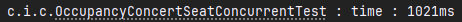
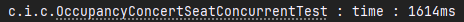
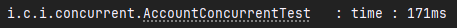
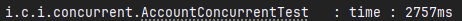
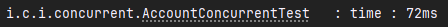
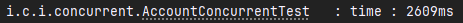
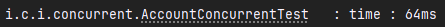
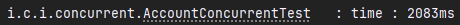

# 동시성 이슈에 대한 분석
## 동시성 이슈가 나타날 기능
 - 콘서트 좌석 임시 점유
 - 포인트 충전 및 결제

## DB락의 종류
### 비관적 락 (Pessimistic Lock)

DB에서 트랜잭션 내에서 해당 로우에 락을 거는 방식<br>
update 시에는 자동적으로 쓰기 락이 걸린다.(READ COMMITTED 이상의 격리 수준에서)<br>
비관적 락을 구현할때 JPA에서는 해당 쿼리 메소드에 @Lock을 사용
```java
    @Lock(LockModeType.PESSIMISTIC_WRITE) or @Lock(LockModeType.PESSIMISTIC_READ)
    ConcertSeat getConcertSeatByConcertSeatId(Long concertSeatId);
```
예시 쿼리 :
```sql
/* PESSIMISTIC_WRITE */
SELECT *
  FROM CONCERT_SEAT
 WHERE CONCERT_SEAT_ID = 1
   FOR UPDATE

/* PESSIMISTIC_READ */
SELECT *
  FROM CONCERT_SEAT
 WHERE CONCERT_SEAT_ID = 1
  LOCK IN SHARE MODE;
```

이 때 해당 로우에 트랜잭션이 유지되는 동안 락이 걸리게 된다.

```sql
SELECT *
  FROM CONCERT_SEAT
 WHERE CONCERT_SEAT_ID = 1
```
MYSQL의 경우 for update로 해당 로우에 락을 걸어도 위의 쿼리로 조회를 하면 조회가 가능하다.(MVCC)

### 낙관적 락

낙관적 락은 version이라는 컬럼을 두어 버전 차이를 이용하여 로직상의 락을 구현하는 방식
entity에 version 컬럼 하나를 추가 하여 사용
```java
    @Version
    private int version;
```
JPA가 update 시에 set에 version + 1 한걸 자동으로 날린다.<br>
트랜잭션 범위 내에서 변경 감지 후 트랜잭션이 종료되기 전 update 문이 실행된다.
```sql
UPDATE CONCERT_SEAT
   SET concert_info_id = ?
     , created_at = ?
     , deleted_at = ?
     , member_id = ?
     , seat_number = ?
     , seat_status = ?
     , updated_at = ?
     , version = 1
 WHERE CONCERT_SEAT_ID = 1
   AND VERSION = 0
```
DB상에서는 락을 거는것이 아니기 때문에(최초 업데이트는 쓰기락이 걸리지만) 이후 공유자원에 대한 요청들은 업데이트 대상 로우가 없기 때문에 비관적 락에 비해 성능 저하가 일어나지 않는다.<br>
DB상에 오류가 나는건 아니지만 update에 대한 리턴이 없을 경우 Hibernate는 OptimisticLockException이 발생하고 Spring은 ObjectOptimisticLockingFailureException로 변환하여 해당 예외가 발생한다.

## 기능에 대한 테스트
### 콘서트 좌석 임시 점유
콘서트 좌석 임시 점유의 경우 최초의 좌석 점유가 되면 이후의 좌석 점유 요청들은 실패가 되기만 하면 됨
- 비관적 락 적용
- 조회부터 읽기 & 쓰기락이 걸림
```java
    @Lock(LockModeType.PESSIMISTIC_WRITE)
    ConcertSeat getConcertSeatByConcertSeatId(Long concertSeatId);
```
```java
    ConcertSeat getConcertSeat = concertSeatRepository.getConcertSeatByIdForUpdate(command.concertSeatId());
    if (getConcertSeat.getMemberId() != null && !getConcertSeat.getSeatStatus().equals(SeatStatus.OPEN)) {
        throw new ConcertBookingException(ErrorCode.OCCUPANCY_SEAT);
    }
    getConcertSeat.occupancySeat(command.memberId());
```
- 낙관적 락 적용
- 락이 걸리지 않는 조회
```java
    @Version
    private int version;
```
```java
    ConcertSeat getConcertSeat = concertSeatRepository.getConcertSeatById(command.concertSeatId());
    if (getConcertSeat.getMemberId() != null && !getConcertSeat.getSeatStatus().equals(SeatStatus.OPEN)) {
        throw new ConcertBookingException(ErrorCode.OCCUPANCY_SEAT);
    }
    getConcertSeat.occupancySeat(command.memberId());
```

쓰레드 1000건의 동시성 테스트
```java
    // given
    long concertSeatId = 1L;
    
    final List<Long> failList = new ArrayList<>();
    final List<Long> successList = new ArrayList<>();
    
    // when
    int threadCount = 1000;
    ExecutorService executorService = Executors.newFixedThreadPool(threadCount);
    CountDownLatch countDownLatch = new CountDownLatch(threadCount);
    for (int i = 1; i < threadCount + 1; i++) {
        final int index = i;
        ConcertSeatDomainDto.OccupancySeatCommand command = new ConcertSeatDomainDto.OccupancySeatCommand(concertSeatId, index);
        executorService.execute(() -> {
            try {
                concertSeatService.occupancySeat(command);
                successList.add((long) index);
            } catch (Exception e) {
                failList.add((long) index);
            } finally {
                countDownLatch.countDown();
            }
        });
    }
    countDownLatch.await();
    
    ConcertSeat concertSeatByMemberId = concertSeatJpaRepository.getConcertSeatByMemberId(successList.getFirst());
    
    // then
    assertAll(() -> {
        assertNotNull(concertSeatByMemberId);
        assertEquals(successList.size(), 1);
        assertEquals(successList.getFirst(), concertSeatByMemberId.getMemberId());
    });
```
- CountDownLatch와 ExecutorService를 사용하여 1000개의 쓰레드를 동시에 실행해 좌석 점유 동시성 테스트를 수행
- occupancySeat 메소드가 실행되며 성공/실패한 경우 각각 successList와 failList에 기록
- 테스트 종료 후 첫 번째 성공한 사용자 ID가 데이터베이스에 반영되었는지 확인
- 처리 시간은 startTime과 endTime을 통해 기록

낙관적 락을 적용 했을 때<br>


비관적 락을 적용 했을 때<br>


- 비관적 락 대비 낙관적 락 사용 시 약 36퍼의 성능 차이를 보임.
- 비관적 락의 경우 조회부터 DB 락이 걸리기에 성능 저하가 있다.
- 낙관적 락의 경우 조회는 락이 걸리지 않기 때문에 비관적 락 대비 성능 저하가 없음.
- 낙관적 락의 경우 재시도 로직을 작성해야 하지만 이후 요청들은 그냥 실패하면 되기때문에 재시도 로직을 작성할 필요가 없다.
- 따라서 좌석 임시 점유의 경우 낙관적 락이 더 좋아보인다.

### 포인트 충전 및 결제
- 비관적 락 적용
```java
    @Lock(LockModeType.PESSIMISTIC_WRITE)
    Account getAccountByAccountId(long accountId);
```
```java
    // 충전
    @Transactional
    public AccountDomainDto.ChargeAccountInfo chargeAccount(AccountDomainDto.ChargeAccountCommand command) {
        Account getAccount = accountRepository.getAccountByIdForUpdate(command.accountId());
        getAccount.chargeBalance(command.amount());

        AccountHistory accountHistory = new AccountHistory(getAccount.getAccountId(), AccountType.CHARGE, command.amount());
        accountHistoryRepository.save(accountHistory);

        return new AccountDomainDto.ChargeAccountInfo(getAccount.getAccountId(), accountHistory.getAmount(), getAccount.getBalance());
    }
    // 결제
    @Transactional
    public AccountDomainDto.PaymentAccountInfo paymentAccount(AccountDomainDto.PaymentAccountCommand command) {
        Account getAccount = accountRepository.getAccountByIdForUpdate(command.accountId());
        Long balance = getAccount.getBalance();
        Long amount = command.amount();
        if (balance - amount < 0) {
            throw new ConcertBookingException(ErrorCode.NOT_ENOUGH_BALANCE);
        }
        getAccount.paymentBalance(command.amount());
    
        AccountHistory accountHistory = new AccountHistory(getAccount.getAccountId(), AccountType.PAYMENT, command.amount());
        accountHistoryRepository.save(accountHistory);
    
        return new AccountDomainDto.PaymentAccountInfo(getAccount.getAccountId(), accountHistory.getAccountHistoryId(), accountHistory.getAmount(), getAccount.getBalance());
}
```

- 낙관적 락 적용
```java
    @Version
    private int version;
```
재시도 로직을 하기 위해 spring-retry 추가
```groovy
    implementation 'org.springframework.retry:spring-retry'
```
Retry 활성화
```java
    @EnableRetry
    @Configuration
    public class RetryConfig {
    }
```
```java
    // 충전
    @Retryable(retryFor = ObjectOptimisticLockingFailureException.class, maxAttempts = 10, backoff = @Backoff(delay = 500))
    @Transactional
    public AccountDomainDto.ChargeAccountInfo chargeAccount(AccountDomainDto.ChargeAccountCommand command) {
        Account getAccount = accountRepository.getAccountById(command.accountId());
        getAccount.chargeBalance(command.amount());

        AccountHistory accountHistory = new AccountHistory(getAccount.getAccountId(), AccountType.CHARGE, command.amount());
        accountHistoryRepository.save(accountHistory);

        return new AccountDomainDto.ChargeAccountInfo(getAccount.getAccountId(), accountHistory.getAmount(), getAccount.getBalance());
    }
    // 결제
    @Retryable(retryFor = ObjectOptimisticLockingFailureException.class, maxAttempts = 10, backoff = @Backoff(delay = 500))
    @Transactional
    public AccountDomainDto.PaymentAccountInfo paymentAccount(AccountDomainDto.PaymentAccountCommand command) {
        Account getAccount = accountRepository.getAccountById(command.accountId());
        Long balance = getAccount.getBalance();
        Long amount = command.amount();
        if (balance - amount < 0) {
            throw new ConcertBookingException(ErrorCode.NOT_ENOUGH_BALANCE);
        }
        getAccount.paymentBalance(command.amount());
    
        AccountHistory accountHistory = new AccountHistory(getAccount.getAccountId(), AccountType.PAYMENT, command.amount());
        accountHistoryRepository.save(accountHistory);
    
        return new AccountDomainDto.PaymentAccountInfo(getAccount.getAccountId(), accountHistory.getAccountHistoryId(), accountHistory.getAmount(), getAccount.getBalance());
    }
    // 재시도 횟수 모두 소진 시 이후 로직
    @Recover
    public void recover(ObjectOptimisticLockingFailureException e) {
    throw new ConcertBookingException(ErrorCode.FAIL_UPDATE_ACCOUNT);
    }
```
- ObjectOptimisticLockingFailureException 이 발생하면 재시도, 10회, 0.5초마다로 설정
- 재시도 횟수가 모두 소진되면 충전 또는 결제 실패 처리

각각 10번씩 동시성 테스트

결제 테스트
```java
    // given
    long memberId = 1L;
    long accountId = 1L;
    long amount = 1000L;

    // when
    int threadCount = 10;
    ExecutorService executorService = Executors.newFixedThreadPool(threadCount);
    CountDownLatch countDownLatch = new CountDownLatch(threadCount);
    for (int i = 0; i < threadCount; i++) {
        final int index = i + 1;
        executorService.execute(() -> {
            long thisAmount = amount * index;
            try {
                accountService.paymentAccount(new AccountDomainDto.PaymentAccountCommand(accountId, thisAmount));
            } finally {
                countDownLatch.countDown();
            }
        });
    }
    countDownLatch.await();

    // then
    long balance = 200000L;
    for (int i = 1; i < 11; i++) {
        balance -= (1000L * i);
    }

    Account result = accountJpaRepository.getAccountById(accountId);

    assertEquals(balance, result.getBalance());
```
충전 테스트
```java
// given
    long memberId = 1L;
    long accountId = 1L;
    long amount = 1000L;

    // when
    int threadCount = 10;
    ExecutorService executorService = Executors.newFixedThreadPool(threadCount);
    CountDownLatch countDownLatch = new CountDownLatch(threadCount);
    for (int i = 0; i < threadCount; i++) {
        final int index = i + 1;
        executorService.execute(() -> {
            long thisAmount = amount * index;
            try {
                accountService.chargeAccount(new AccountDomainDto.ChargeAccountCommand(accountId, thisAmount));
            } finally {
                countDownLatch.countDown();
            }
        });
    }
    countDownLatch.await();

    // then
    long balance = 200000L;
    for (int i = 1; i < 11; i++) {
        balance += (1000L * i);
    }

    Account result = accountJpaRepository.getAccountById(accountId);

    assertEquals(balance, result.getBalance());
```
충전 및 결제 테스트
```java
    // given
    long memberId = 1L;
    long accountId = 1L;
    long amount = 1000L;

    // when
    int threadCount = 10;
    ExecutorService executorService = Executors.newFixedThreadPool(threadCount);
    CountDownLatch countDownLatch = new CountDownLatch(threadCount);
    for (int i = 1; i < threadCount + 1; i++) {
        final int index = i;
        executorService.execute(() -> {
            long thisAmount = amount * index;
            if (index % 2 == 0) {
                try {
                    accountService.chargeAccount(new AccountDomainDto.ChargeAccountCommand(accountId, thisAmount));
                } finally {
                    countDownLatch.countDown();
                }
            } else {
                try {
                    accountService.paymentAccount(new AccountDomainDto.PaymentAccountCommand(accountId, thisAmount));
                } finally {
                    countDownLatch.countDown();
                }
            }

        });
    }
    countDownLatch.await();

    // then
    long balance = 200000L;
    for (int i = 1; i < 11; i++) {
        if (i % 2 == 0) {
            balance += (1000L * i);
        } else {
            balance -= (1000L * i);
        }
    }

    Account result = accountJpaRepository.getAccountById(accountId);

    assertEquals(balance, result.getBalance());
```

충전 및 결제
- 비관적 락<br>

- 낙관적 락<br>


충전
- 비관적 락<br>

- 낙관적 락<br>


결제
- 비관적 락<br>

- 낙관적 락<br>


- 각각의 경우 낙관적 락이 시간은 훨씬 오래 소요가 된다.
- 이유는 재시도 텀이 0.5초여서 더 오래걸렸다.
- 그러나 비관적 락의 경우 DB에서 select 시에 해당 row에 락을 걸기 때문에 더 무거운 작업이다.
- 포인트 충전 및 결제의 경우 한명의 유저가 충전 또는 결제를 동시에 할 경우가 매우 드물다.
- 따라서 낙관적 락이 더 좋을것 같다.