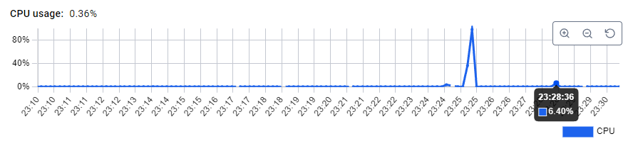
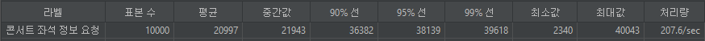
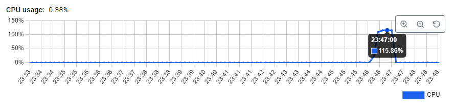
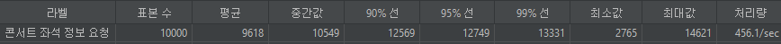

## 캐싱을 통해 성능 향상하기
캐싱을 통해 DB조회를 줄여 부하를 줄일 수 있는 기능들 선정하기
- 콘서트 정보 조회
  - concertInfoId, 콘서트 이름, 콘서트 날짜 등의 거의 변하지 않는 정보들
- 잔여 좌석 조회
  - concertInfoId의 해당 콘서트, 해당 날짜의 잔여 좌석 조회 정보

### 콘서트 정보 조회 캐싱하기
```java

    public List<ConcertFacadeDto.GetConcertInfoResult> getConcertInfo(long concertId) {
        ConcertDomainDto.GetConcertInfo getConcert = concertService.getConcert(concertId);
        List<ConcertInfoDomainDto.GetConcertInfoListInfo> concertInfoList = concertInfoService.getConcertInfoList(getConcert.concertId());
        return concertInfoList.stream().map(concertInfo -> new ConcertFacadeDto.GetConcertInfoResult(
                getConcert.concertId(),
                concertInfo.concertInfoId(),
                getConcert.concertName(),
                concertInfo.concertDate()
        )).toList();
    }

    public List<ConcertFacadeDto.GetConcertInfoResult> getConcertInfo(long concertId) {
        String concertKey = CONCERT_PREFIX + concertId;
        if (Boolean.TRUE.equals(redisTemplate.hasKey(concertKey))) {
            return redisTemplate.opsForValueGetAsJsonList(concertKey, new TypeReference<>() {});
        }
        ConcertDomainDto.GetConcertInfo getConcert = concertService.getConcert(concertId);
        List<ConcertInfoDomainDto.GetConcertInfoListInfo> concertInfoList = concertInfoService.getConcertInfoList(getConcert.concertId());
        List<ConcertFacadeDto.GetConcertInfoResult> result = concertInfoList.stream().map(concertInfo -> new ConcertFacadeDto.GetConcertInfoResult(
                getConcert.concertId(),
                concertInfo.concertInfoId(),
                getConcert.concertName(),
                concertInfo.concertDate()
        )).toList();

        redisTemplate.opsForValueSetAsJson(concertKey, result, 12L, TimeUnit.HOURS);

        return result;
    }
```
기존 DB조회 해서 넘겨 주던 서비스 에서 최상단에 redis에 해당 키가 있는지 확인 후 있으면 꺼내서 넘겨주고 없으면 DB 조회 후 redis에 저장하는 로직으로 구성하였다.
해당 데이터는 거의 변하지 않을 데이터라서 12시간의 유효시간을 주었다.

10초간 10000건의 요청
- DB조회로만 요청시
  - jmeter 결과
  - 
  - mysql cpu 사용량
  - 
- redis 캐싱을 진행하여 요청시
  - jmeter 결과
  - 
  - redis cpu 사용량
  - 
  - mysql cpu 사용량
  - 

결과를 보면 p99 값 기준 400% 이상의 성능 향상을 보인다.
또한 도커에 띄운 mysql의 부하도 DB조회만 했을때 98% 까지 치솟았지만 redis 캐싱을 적용했을시 redis는 고작 2%, mysql도 6%대의 cpu 사용량을 보였다.


### 잔여 좌석 조회
```java
    public List<ConcertFacadeDto.GetConcertSeatListResult> getConcertSeatList(String token) {
        Map<String, Long> payload = tokenService.decodeToken(token);
      
        long concertId = payload.get("concertId");
        long concertInfoId = payload.get("concertInfoId");
        
        concertService.getConcert(concertId);
        concertInfoService.getConcertInfo(concertInfoId);
        List<ConcertSeatDomainDto.GetConcertSeatListInfo> concertSeatInfoList = concertSeatService.getConcertSeatList(concertInfoId);
      
        List<ConcertFacadeDto.GetConcertSeatListResult> result = concertSeatInfoList.stream().map(concertSeatInfo -> new ConcertFacadeDto.GetConcertSeatListResult(
                concertSeatInfo.concertSeatId(),
                concertSeatInfo.concertInfoId(),
                concertSeatInfo.seatNumber(),
                concertSeatInfo.seatStatus(),
                concertSeatInfo.createdAt(),
                concertSeatInfo.updatedAt()
        )).toList();

        return result;
    }

    public List<ConcertFacadeDto.GetConcertSeatListResult> getConcertSeatList(String token) {
        Map<String, Long> payload = tokenService.decodeToken(token);

        long concertId = payload.get("concertId");
        long concertInfoId = payload.get("concertInfoId");

        String concertInfoKey = CONCERT_INFO_PREFIX + concertInfoId;
        if (Boolean.TRUE.equals(redisTemplate.hasKey(concertInfoKey))) {
            return redisTemplate.opsForValueGetAsJsonList(concertInfoKey, new TypeReference<>() {});
        }

        concertService.getConcert(concertId);
        concertInfoService.getConcertInfo(concertInfoId);
        List<ConcertSeatDomainDto.GetConcertSeatListInfo> concertSeatInfoList = concertSeatService.getConcertSeatList(concertInfoId);

        List<ConcertFacadeDto.GetConcertSeatListResult> result = concertSeatInfoList.stream().map(concertSeatInfo -> new ConcertFacadeDto.GetConcertSeatListResult(
                concertSeatInfo.concertSeatId(),
                concertSeatInfo.concertInfoId(),
                concertSeatInfo.seatNumber(),
                concertSeatInfo.seatStatus(),
                concertSeatInfo.createdAt(),
                concertSeatInfo.updatedAt()
        )).toList();

        redisTemplate.opsForValueSetAsJson(concertInfoKey, result, 10L, TimeUnit.SECONDS);

        return result;
    }
```
해당 서비스 코드도 마찬가지로 redis에 확인 후 없으면 db조회해서 redis에 10초의 유효시간을 주고 데이터를 넣는식으로 했다.
10초의 유효시간은 잔여 좌석 상태는 매우 자주 바뀌는 데이터이기 때문에 선정했다.

10초간 10000건의 요청
- DB조회로만 요청시
  - jmeter 결과
  - 
  - mysql cpu 사용량
  - 
- redis 캐싱을 진행하여 요청시
  - 
  - redis cpu 사용량
  - 
  - mysql cpu 사용량
  - 

결과를 보면 p99 기준 289% 의 성능 향상을 보인다.
mysql의 cpu 사용량도 115%에서 70% 대로 부하가 줄었다.
여전히 70%대의 부하는 interceptor에서 token 검증 시 대기열 db조회 때문에 여전한 부하를 보인다.
대기열도 redis로 이관한다면 db조회가 없을것으로 예상된다.

단순히 조회 서비스에 cash-aside로만 적용해서 캐싱을 구현했는데 캐시 정합성을 유지하기 위한 추가적인 조치를 해야한다.
- 콘서트 정보가 변경될때 redis 캐시 정보 변경
- 잔여 좌석 상태가 변경되었을때 redis 캐시 정보 변경
- 잔여 좌석 상태는 매우 자주 바뀌는 데이터이기 때문에 스케줄러로 5초마다 redis 캐시 정보 변경