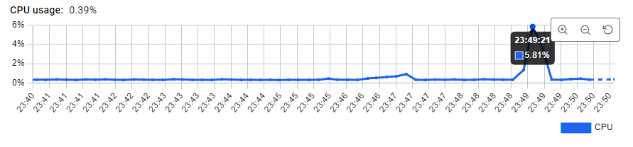
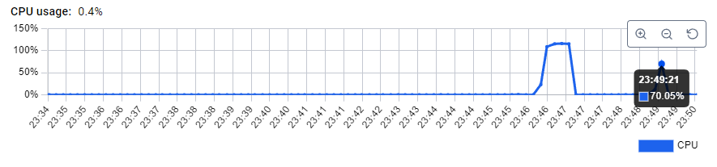
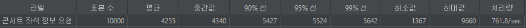
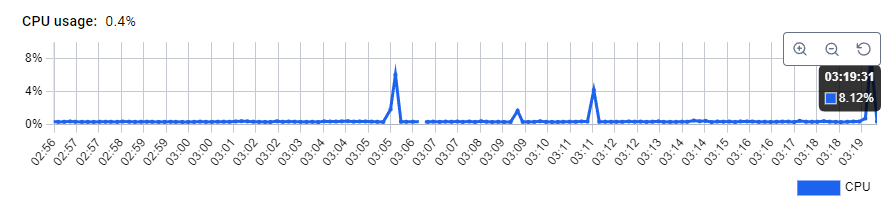
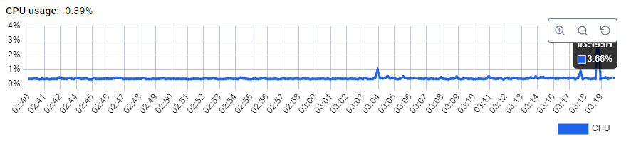

대기열 db -> redis 전환에 따른 기존 잔여 좌석 조회 test
- 기존 잔여좌석조회는 redis, 대기열은 db일때
  - jmeter
  - 
  - redis cpu
  - 
  - mysql cpu
  - 
- 잔여좌석조회 및 대기열 모두 redis
  - jmeter
  - 
  - redis cpu
  - 
  - mysql cpu
  - 

jmeter p99 236% 성능 향상
mysql cpu 부하 70% -> 3.6%
redis cpu 부하 5.8% -> 8.1%

redis의 부하는 미세하게 늘었으나 mysql의 부하가 획기적으로 줄어들었다.
jmeter p99의 경우에도 236%의 성능 향상을 이루었다.