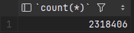
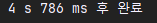
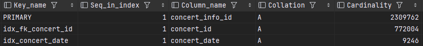

## 쿼리 파악 및 인덱스 적용하기

### 조회 쿼리가 있는 기능
- 콘서트 정보 조회
- 콘서트 좌석 정보 조회
- 예약 정보 조회
- 예약 정보 목록 조회
- 결제
- 충전
- 잔액 확인
- 스케줄러로 돌아가는 당일 전체 콘서트 정보 조회

스케줄러의 정보 조회 빼고는 간단히 pk로 조회하고 fk로 조인하는 테이블이다.

### fk 키에 인덱스 걸기

```sql
select c.concert_id
     , c.concert_name
     , ci.concert_date
  from concert c
 inner join concert_info ci
    on ci.concert_id = c.concert_id
 where c.concert_id = 1
```
이 쿼리를 explain으로 실행 계획을 보면


ci에는 별다른 concert_id를 가지고 있지만 인덱스를 가지고 있지 않아서 풀스캔을 하게 된다.
<br>
총 1.076초가 걸렸다.

fk에 인덱스를 추가하였다.
```sql
create index idx_fk_concert_id on concert_info (concert_id);
```
concert_info 테이블의 수는 다음과 같다.



fk에 인덱스를 걸어주었다.<br>


231만개의 row가 있는 테이블에 인덱스를 걸때 총 4.905초가 걸렸으며 mysql의 cpu 사용량도 올라갔다.
<br>
**row수가 많은 테이블에 인덱스를 걸때는 사이트이펙트를 고려하여 추가해야 한다.**

이렇게 fk에 인덱스를 걸고 다시 조회를 해보면


type이 ref로 인덱스를 참조하여 row수가 약 2,300,000에서 3으로 줄어들었다.

<br>
조회 시간도 1.076초에서 0.042초로 성능개선이 된걸 볼 수 있다.

저런 종속성이 있는 테이블의 fk들에는 모두 인덱스를 걸어주어야 성능이 떨어지지 않는다.

### where 조건에 index 걸기

당일 콘서트 정보 조회는 where 조건에 콘서트 일자를 받아 조회를 한다.
```sql
select distinct concert_info_id
  from concert_info
 where concert_date = '2023-01-02'
```
explain

<br>
풀스캔을 하게 되어 rows가 더 늘어날 경우 조회가 점점 더 오래걸릴것으로 예상된다.

where 조건인 concert_date에 인덱스를 걸어주자
```sql
create index idx_concert_date on concert_info (concert_date)
```



<br>
풀스캔에서 인덱스 참조로 바뀌고 따라서 조회 row가 약 2,300,000에서 256으로 줄어들었으며 1.047초 -> 0.035초로 성능개선을 이루었다.


<br>
카디널리티는 전체 로우수의 1% 미만으로 전체 로우수 대비 높진 않지만 자주 조회되는 쿼리의 성능을 줄일수 있으므로 유의미한 인덱스라고 볼수있다.

이외의 비즈니스 로직상 조회는 아니지만 통계 조회를 한다고 했을때 추가로
- 예약정보에 created_at에 인덱스 걸기
- account_history의 crated_at에 인덱스 걸기 등등

기간을 산정하여 통계를 낼수 있는 테이블에 created_at에 인덱스를 걸어 조회성능을 높일수 있을것 같다.